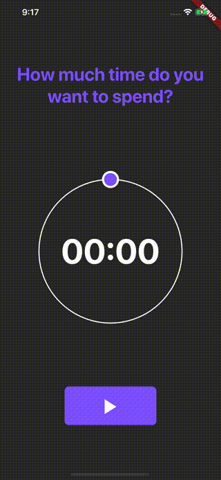

# Spiramentum 2

## About

A little side project of mine with a single purpose:
- Show a configurable timer
- Notify once the timer is up
- Store the time spent ans mindful time in HealthKit

Key aspects:
- minor animation
- native plugins for UNUserNotifications (when app is in foreground and background) and HealthKit write access

## Hey, that's a Flutter app, what about Android?

Yes, this is a flutter app but it intended for iOS only!

## What does "Spiramentum" mean?

Ask [wikipedia](https://en.wiktionary.org/wiki/spiramentum)

## Where can I find Spiramentum 1?

I've built this app a couple of times in Swift, SwiftUI, Xamarin.Forms and Flutter to get a feeling
of the different frameworks and approaches. I ended up with Flutter because it is easy to learn
and "works". SwiftUI on the other hand is too buggy and I have spent too much time with Swift and 
Xamarin. So long story short, this app has (at least) earned major version number 2. 

¯\\_(ツ)_/¯

## License

[MIT](./LICENSE)

## Contact

Come find me at [hennessen.net](http://hennessen.net) (find my Twitter, LinkedIn, etc. info there)
 
 

